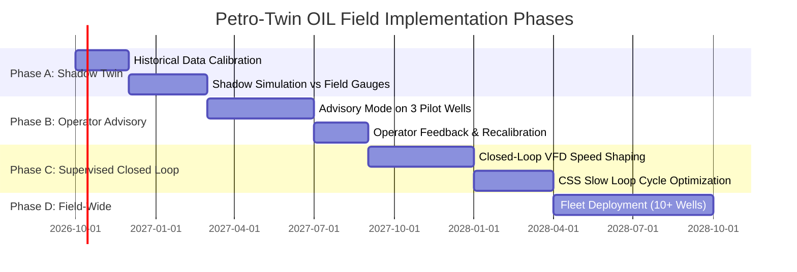

# Oil India Limited (OIL) Industrial Integration & Deployment Roadmap
**Project:** PETRO-TWIN (SIH 2026, PS26120)  
**Target Asset:** Baghewala Heavy Oil Field, Jodhpur Sandstone, Rajasthan  
**Document Classification:** Engineering Integration Specification  

---

## 1. Executive Summary

PETRO-TWIN is architected as an **industrial-grade digital twin and decision support system (DSS)** for Cyclic Steam Stimulation (CSS) and Sucker Rod Pump (SRP) joint optimization in extra-heavy crude (17–19° API, 1,200+ cP). This document defines the engineering pathway for integrating PETRO-TWIN with Oil India Limited’s field infrastructure, SCADA systems, operational historians, and edge automation assets.

---

## 2. Field Integration Architecture

```text
 ┌────────────────────────────────────────────────────────────────────────┐
 │                      OIL BAGHEWALA FIELD ASSETS                        │
 │  Steam Generation Plant  │  Wellhead X-Tree  │  VFD SRP Pumping Units  │
 └─────────────┬────────────────────┬────────────────────┬────────────────┘
               │ 4-20mA / Modbus RTU│                    │
 ┌─────────────▼────────────────────▼────────────────────▼────────────────┐
 │                 FIELD RTUs & EDGE AUTOMATION GATEWAY                   │
 │       (Moxa / Schneider / Allen-Bradley with Edge Python Runtime)      │
 │  • Sub-second polished rod position & load acquisition (Dynacard)      │
 │  • Real-time Float Margin Index computation (M_float >= 1.0)           │
 │  • Local VFD Downstroke Speed Shaping control (0.50x - 1.00x)          │
 └──────────────────────────────────┬─────────────────────────────────────┘
                                    │ OPC UA / MQTT Sparkplug B (TLS 1.3)
 ┌──────────────────────────────────▼─────────────────────────────────────┐
 │                OIL CENTRAL SCADA & DATA HISTORIAN                      │
 │                  (OSIsoft PI / AVEVA / Honeywell)                      │
 │  • Injection pressure, steam quality, daily oil/water production       │
 │  • Downhole sensor logs (BHT, PIP, casing pressure)                    │
 └──────────────────────────────────┬─────────────────────────────────────┘
                                    │ REST API / PI Web API / Kafka
 ┌──────────────────────────────────▼─────────────────────────────────────┐
 │                      PETRO-TWIN ENTERPRISE CORE                        │
 │  ┌─────────────────────────┐         ┌───────────────────────────────┐ │
 │  │   Physics Digital Twin  │◄───────►│  Hybrid Residual ML Corrector │ │
 │  │   (Marx-Langenheim/Gibbs)         │  (LightGBM + Quantile p10/90) │ │
 │  └───────────┬─────────────┘         └───────────────▲───────────────┘ │
 │              │                                       │                 │
 │  ┌───────────▼─────────────┐         ┌───────────────┴───────────────┐ │
 │  │ Strict Constraint Engine│◄───────►│ Pareto Multi-Objective Co-Opt │ │
 │  │ (Fracture, Rod Fatigue) │         │ (Net Benefit vs SOR vs Energy)│ │
 │  └───────────┬─────────────┘         └───────────────────────────────┘ │
 └──────────────┼─────────────────────────────────────────────────────────┘
                │ WebSockets / REST
 ┌──────────────▼─────────────────────────────────────────────────────────┐
 │                   INDUSTRIAL WEB CONTROL CENTER                        │
 │           (Production Engineers, Asset Managers, Field Operators)      │
 └────────────────────────────────────────────────────────────────────────┘
```

---

## 3. Data Ingestion Protocols

### 3.1 SCADA / Historian Connectivity
- **Primary Protocol:** OPC UA (IEC 62541) with X.509 certificate authentication.
- **Secondary Protocol:** MQTT Sparkplug B for low-bandwidth cellular telemetry from remote desert well pads in the Thar Desert.
- **Historian Connector:** OSIsoft PI Web API adapter or Kafka ingestion topic publishing telemetry to `telemetry_ingest_service`.

### 3.2 Telemetry Ingestion Cadence
| Telemetry Stream | Instrument | Frequency | Payload |
| :--- | :--- | :--- | :--- |
| **SRP Dynacard** | Polished rod load cell + Hall-effect crank angle | 1 stroke every 15 min | 100-point surface position/load + computed downhole pump card |
| **CSS Injection** | Coriolis meter + Rosemount transmitter | 10 seconds | Mass flow (t/h), injection pressure (bar), steam enthalpy/temp (°C) |
| **Production Gauge** | Automated Well Test (AWT) separator | 24 hours | Gross liquid (bpd), water cut (%), Net oil recovery (bbl) |
| **Downhole Telemetry** | Quartz gauge / fiber optic DTS | 1 minute | Bottomhole temperature (°C), pump intake pressure (bar) |

---

## 4. Operational Technology (OT) & Cybersecurity

PETRO-TWIN adheres to **ISA/IEC 62443** (Security for Industrial Automation and Control Systems):
1. **Network Segmentation (Purdue Model):**
   - **Level 2 (Control):** Field VFDs and RTUs execute local anti-float safety override autonomously.
   - **Level 3 (Operations):** On-premises Petro-Twin digital twin cluster deployed within OIL's secure operational DMZ.
   - **Level 4 (Enterprise):** Cloud dashboard access through TLS 1.3 reverse proxy with Active Directory / SAML Single Sign-On (SSO).
2. **Read-Only Default:** All initial phases operate in strictly read-only advisory mode. No setpoint is transmitted to the PLC without cryptographic engineer sign-off.
3. **Impassable Hard Safety Interlocks:** Local PLC ladder logic retains hard emergency stop (ESD) limits (max injection pressure 125 bar, max PPRL 28,000 lbs) that CANNOT be overwritten by software.

---

## 5. Staged Field Rollout Roadmap



### Phase A: Shadow Digital Twin (Months 1–5)
- Ingest historical multi-cycle data from 5 Baghewala wells.
- Calibrate Boberg-Lantz thermal dissipation models to measured reservoir shut-in logs.
- Run shadow forecasts without altering physical well operations.
- **Success Gate:** Model MAE $< 5.0$ bpd; KS-test drift monitor active.

### Phase B: Operator Advisory Mode (Months 6–11)
- Deploy Petro-Twin on 3 pilot wells in Baghewala (e.g., BGW-01, BGW-02, BGW-03).
- System provides daily recommended setpoints (SPM, VFD ratio, steam allocation).
- Engineers review recommendations via What-If sandbox before manually updating RTU setpoints.
- **Success Gate:** $\ge 20\%$ reduction in rod-floating alarms; zero parted rod incidents.

### Phase C: Supervised Closed-Loop Lift Control (Months 12–18)
- Automate fast-loop SRP control: Petro-Twin edge sidecar adjusts VFD downstroke shaping dynamically based on real-time fluid temperature and load.
- Slow-loop CSS steam schedules remain under manual engineer confirmation.
- **Success Gate:** $+15\%$ increase in electrical energy efficiency (kWh/bbl); confirmed $+20\%$ net economic lift.

### Phase D: Field-Wide Autonomous Optimization (Months 19+)
- Scale to all producing CSS wells across the Baghewala field.
- Centralized field-level steam generator allocation balancing overall field steam capacity.

---

## 6. Official Disclaimer
*All system integrations, simulation parameters, and mathematical equations described herein are calibrated to open technical literature (SPE-165448, Marx-Langenheim 1959, API Spec 11B/11E). No proprietary, restricted, or secret data of Oil India Limited has been utilized.*
